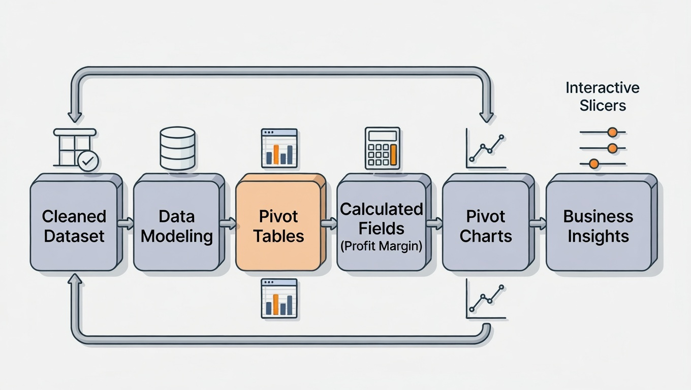
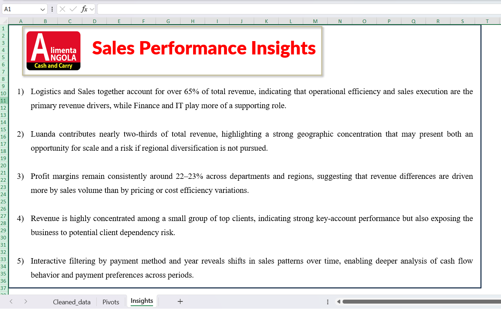

# 📊 Excel Sales Analysis Using Pivot Tables  
### Retail Performance Dashboard (Angola)

<p align="center">
  
</p>

---

## 📌 Project Overview

This project focuses on **sales performance analysis and business insight generation** using Microsoft Excel Pivot Tables and Pivot Charts in a retail business context.

> ⚠️ **Data Ethics & Confidentiality Notice**  
> The dataset used in this project is **synthetically and randomly generated for learning and practice purposes only**.  
> Although the company name **ALIMENTA ANGOLA RETAIL, LDA** refers to a real retail operator in Angola, **the data does not represent real transactions, clients, or financial records**.  
> This ensures **ethical use of company names, data confidentiality, and professional integrity**.

The objective of this task is to transform a **cleaned dataset** into **actionable business insights** through aggregation, visualization, and interpretation.

---

## 🛠 Tools Used

- Microsoft Excel  
- Pivot Tables & Pivot Charts  
- Slicers for interactivity  
- CSV & XLSX formats  

---

## 📂 Project Structure

```
Excel-Sales-Analysis-Pivot-Retail-Angola/
│
├── data/
│ ├── cleaned_dataset.xlsx
│ └── cleaned_dataset.csv
│
├── analysis/
│ ├── Pivot_Report.xlsx
│ └── Pivot_Report.pdf
│
├── images/
│ ├── dashboard/
│ │ └── pivot_tables_and_charts.png
│ │
│ ├── insights/
│ │ └── insights.png
│ │
│ ├── workflow/
│ │ ├── workflow_step_1.png
│ │ ├── workflow_step_2.png
│ │ └── workflow_final.png
│ │
│ └── cover.png
│
├── README.md
└── LICENSE
```

---

## 🔄 Analysis Workflow

<p align="center">
  
</p>

> **Workflow Summary**  
> Cleaned Dataset → Data Modeling → Pivot Tables → Calculated Fields →  
> Pivot Charts → Interactive Filtering → Business Insights

---

## 📊 Dashboard Overview

The interactive dashboard provides a multi-dimensional view of sales performance:

- Sales by Department  
- Sales by Region  
- Sales by Client  
- Top 5 Clients  
- Profit and Profit Margin analysis  
- Filters by Payment Method and Year  

📸 **Pivot Tables & Charts**  
<p align="center">
  
</p>

---

## 📈 Key Insights

📸 **Insights Summary Sheet**  
<p align="center">
  
</p>

### 🔍 Business Insights Extracted

1. **Revenue Concentration by Department**  
   Logistics and Sales together account for over 65% of total revenue, indicating that operational efficiency and sales execution are the primary revenue drivers, while Finance and IT play more of a supporting role.

2. **Geographic Revenue Concentration**  
   Luanda contributes nearly two-thirds of total revenue, highlighting strong market dominance but also presenting both an opportunity for scale and a risk due to limited regional diversification.

3. **Profit Margin Consistency**  
   Profit margins remain consistently around 22–23% across departments and regions, suggesting that revenue differences are driven more by sales volume than by pricing or cost efficiency variations.

4. **Client Concentration Risk**  
   Revenue is highly concentrated among a small group of top clients, indicating strong key-account performance but exposing the business to potential client dependency risk.

5. **Temporal & Payment Behavior Insights**  
   Interactive filtering by payment method and year reveals shifts in sales patterns over time, enabling deeper analysis of cash flow behavior and payment preferences.

---

## ✅ Final Deliverables

- Interactive Excel Pivot Dashboard  
- PDF version of the analysis  
- Structured insights for decision-making  
- Reusable dataset for BI tools  

---

## 🚀 Skills Demonstrated

- Excel Pivot Tables & Pivot Charts  
- Calculated Fields (Profit Margin)  
- Business performance analysis  
- Data storytelling & insight generation  
- Ethical handling of synthetic data  

---

## 👤 Author

**Arao Zau Macaia**  
Data Analytics Intern | Electronics & Communication Engineering  

> 🎓 **Context**  
> This project was completed as part of a **Data Analytics Internship** at **Elevate Labs, India**, focusing on analytical thinking, business understanding, and professional communication.

🔗 **Connect with me**  
- LinkedIn: https://www.linkedin.com/in/araomacaia/ 
- GitHub: https://github.com/araomacaia 
